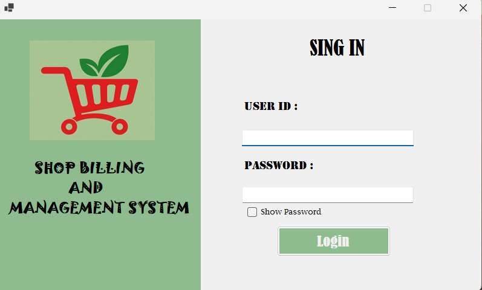
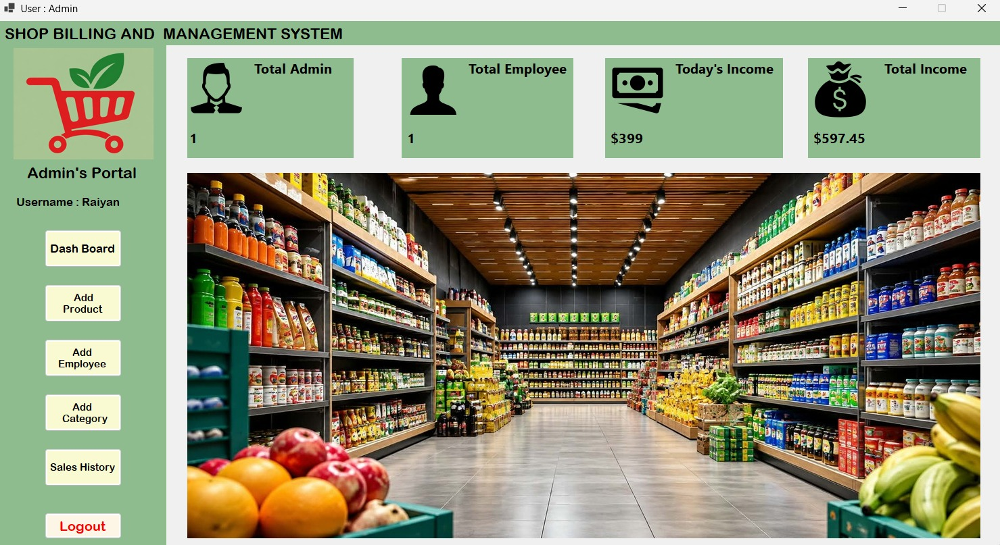
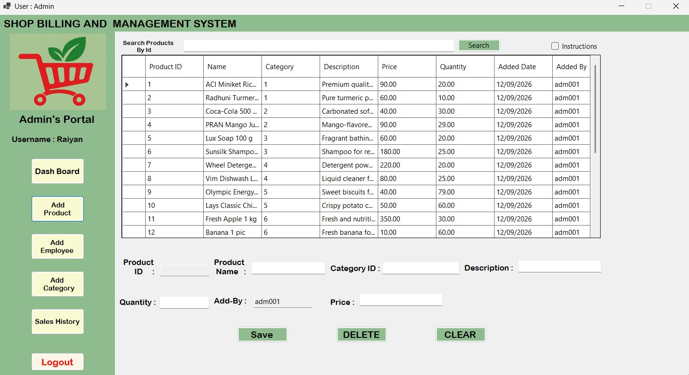
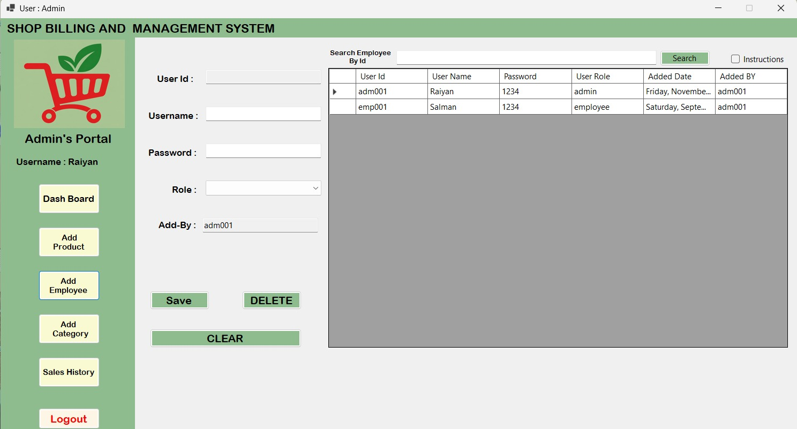
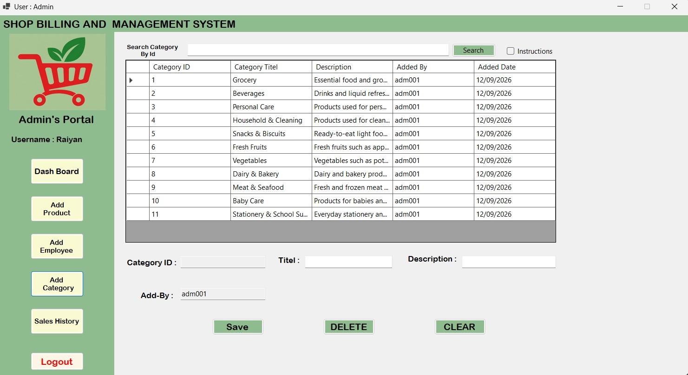
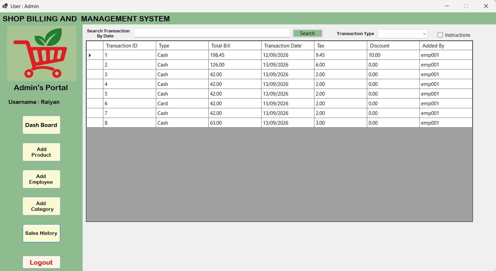
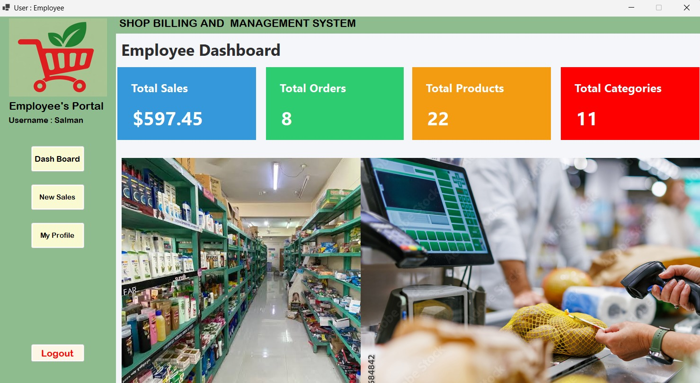
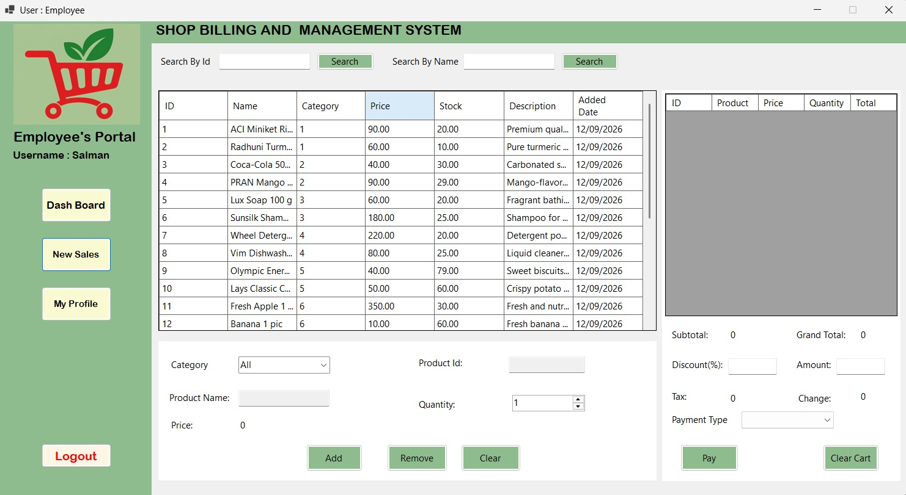
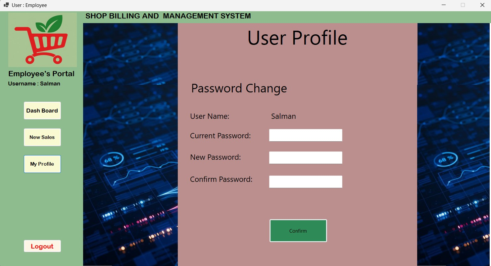
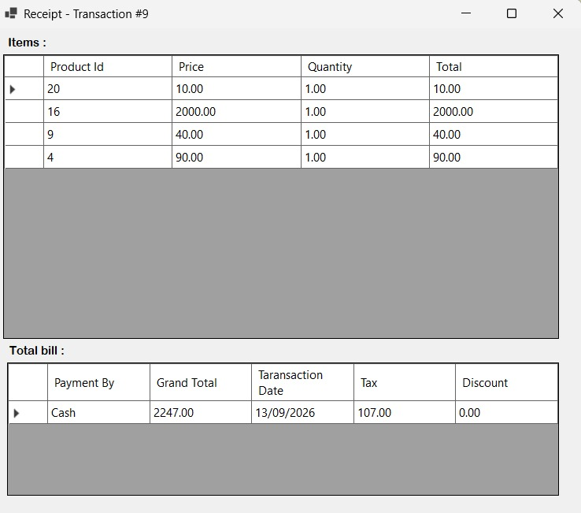

# Shop Billing System (Point of Sale)

A robust and user-friendly desktop application built with **C# Windows Forms (.NET)** for managing shop inventory, employees, and processing daily sales (Point of Sale).

## 🚀 Features

The application is divided into two distinct roles: **Admin** and **Employee**, each with tailored functionalities.

### 🛡️ Admin Features
- **Dashboard:** Overview of system statistics (total sales, total users, etc.).
- **Manage Categories:** Add, edit, or delete product categories.
- **Manage Products:** Add new products, update prices, manage stock quantities, and assign them to categories.
- **Manage Employees:** Create and manage employee user accounts for the system.
- **Sales History:** View past transactions and billing history.

### 🛒 Employee / POS Features
- **Point of Sale (POS):**
  - Search products by ID, Name, or filter by Category.
  - Add products to a shopping cart with real-time stock validation.
  - Automatic calculation of Subtotal, Tax (5%), Discount, and Grand Total.
  - Calculate change to be returned to the customer.
  - Process payments and automatically deduct sold quantities from inventory.
- **Receipt Generation:** Automatically generates a receipt after a successful transaction.
- **Employee Profile:** Employees can view and manage their profile details.

## 🛠️ Technology Stack

- **Language:** C#
- **Framework:** .NET (Windows Forms)
- **Database:** Microsoft SQL Server (LocalDB / SQLEXPRESS)
- **Data Access:** ADO.NET (`System.Data.SqlClient` / `Microsoft.Data.SqlClient`)

## 🗄️ Database Schema

The system uses a relational database design with the following key tables:
- `tbl_users`: Stores Admin and Employee credentials and details.
- `tbl_categories`: Stores product categories.
- `tbl_products`: Stores inventory items, pricing, and available stock.
- `tbl_transactions`: Stores the main receipt/header info for a sale (Total, Tax, Discount, Date).
- `tbl_transaction_detail`: Stores the individual items purchased in a specific transaction.

## ⚙️ Setup & Installation

1. **Clone the repository:**
   ```bash
   git clone https://github.com/your-username/ShopBillingSystem.git
   ```

2. **Database Configuration:**
   - Ensure you have **Microsoft SQL Server Express** installed (`localhost\SQLEXPRESS`).
   - Create a new database named `ShopBillingSystem`.
   - Execute the SQL queries provided in the `queries.txt` file to generate the required tables and insert demo data.

3. **Update Connection String:**
   - Open the project in Visual Studio.
   - Go to the `DataAccess.cs` file located in `WinFormsApp1/UI/` or the root folder.
   - If your SQL Server instance name is different, update the connection string accordingly:
     ```csharp
     this.Sqlcon = new SqlConnection(@"Data Source=localhost\SQLEXPRESS;Initial Catalog=ShopBillingSystem;Integrated Security=True;Encrypt=True;Trust Server Certificate=True");
     ```

4. **Run the Application:**
   - Build the solution (Ctrl + Shift + B).
   - Start the application (F5).
   - Log in using an Admin or Employee account.

## 📸 Screenshots

### Application Views











---
*Developed as a C# Windows Forms Application Project.*
